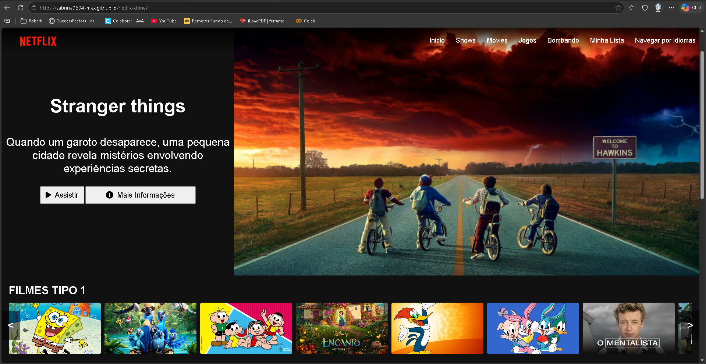

# 🎬 Netflix Clone

Projeto inspirado na interface da Netflix, desenvolvido com HTML, CSS e JavaScript.

## 📸 Preview



---

## 🚀 Tecnologias utilizadas

- HTML5
- CSS3
- JavaScript
- Font Awesome

---

## 🎯 Funcionalidades

- Header fixo com menu de navegação
- Banner principal com destaque de filme/série
- Botões interativos (Assistir / Mais informações)
- Carrosséis horizontais de filmes
- Scroll lateral com botões
- Efeito hover nos filmes

---

## 📂 Estrutura do projeto

```bash
📁 netflix-clone
 ├── 📁 img
 ├── index.html
 ├── style.css
 ├── script.js
```

---

## ▶️ Como executar o projeto

1. Clone o repositório:

```bash
git clone https://github.com/sabrina0604-max/netflix-clone.git
```

2. Abra o arquivo `index.html` no navegador.

---

## 💻 Demonstração

Acesse o projeto online:

[Acessar projeto](https://sabrina0604-max.github.io/netflix-clone/)

---

## 📌 Melhorias futuras

- Responsividade para mobile
- Animação mais suave no carrossel
- Integração com API de filmes
- Sistema de categorias dinâmicas
- Login fake estilo Netflix

---

## 👩‍💻 Autora

Feito por [Sabrina Rodrigues Medeiros](https://github.com/sabrina0604-max)
